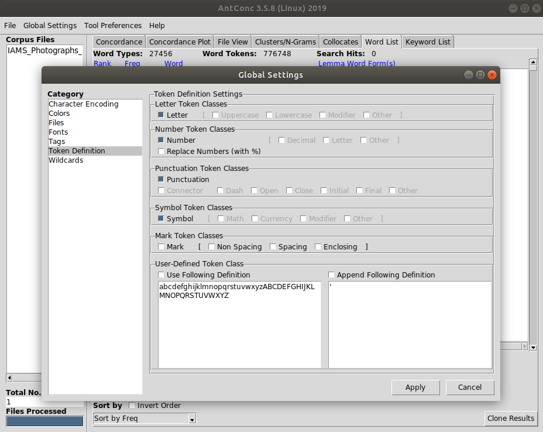

As discussed in the [previous episode](https://cataloguelegacies.github.io/antconc.github.io/03-layout/index.html), in AntConc settings can be reached via the navbar and are separated into `Global Settings` (which contains settings that apply to all tools, including font sizes and colours) and `Tool Preferences` (which contains tool specific settings). Note that in some versions of AntConc `Global Settings` and `Tool Preferences` appear together under the heading `Settings`.

## Global Settings

The `Global Settings` screeen has seven categories, all of which are described in the [AntConc help pages](https://www.laurenceanthony.net/software/antconc/). We will focus on two of these: `Character Encoding` and `Token Definition`.

The `Character Encoding` category has one option: to edit how the text is encoded. By default, the encoding is set to `Unicode (UTF-8)`, which is the most common [character encoding](https://en.wikipedia.org/wiki/UTF-8) set for text that uses the Latin alphabet. We will leave this setting unchanged, but if we hit `Edit` we note that AntConc supports encodings for a range of character sets.

`Token Definition` contains a number of options that Antconc will use to define which tokens (letters, numbers, punctuation) should be treated as important. For example, if ampersands are regularly used in a corpus to represent the word `and`, we would need to make sure that AntConc treated the token "&" as an item of interest, rather than passed over it. Equally, for catalogue data where series of numbers are used to represent a feature of the collections, lingustic analysis of that data might benefit from being able to - say - conduct sorts that include those sequences.

Note that `Letter` is ticked by default (otherwise AntConc would have nothing to analyse!). For the purpose of these training materials, you should also tick `Number`, `Punctuation`, and `Symbol`. To save your settings, hit `Apply`.

> ## Saving settings
>
> Each time you exit AntConc, the settings revert to the default. This means that we need to check these settings each time we launch AntConc. Thankfully, AntConc makes this easier (as well as supporting the production of reproducible results) by enabling you to export your settings to file and then import them each time you launch.
>* To export your settings, click `File` in the navbar, then `Export Settings to File...`. AntConc will then prompt you to save a file with the extension `.ant`. We recommend renaming this file to something sensible (a date, something about your project) and saving it with your corpus.
>* To import your settings, click `File` in the navbar, then `Import Settings from File...`.  Now navigate to your saved `.ant` file and hit `Open`. Should you need them, we've [made available in our repo](https://github.com/CatalogueLegacies/antconc.github.io/tree/gh-pages/data) a `.ant` file with the settings needed for these training materials.
{: .callout}

## Tool Preferences

The `Tool Preferences` screen is seperated into six categories, one for each AntConc tool.

Browsing through them you will note that some options replicate those in the tool window: for example, you can change the case sensitivity of the `Word List` tool both in the `Tool Preferences` screen and in the `Word List` window. 

Many of the options here in the `Tool Preferences` screen change the layout or appearance of the tool window, but some can fundamentally change the outputs you get from using a tool. A few examples include:

- The `Collocates` preferences allow you to chose from four different statistical measures of collocation.
- The `Word List` preferences allows you to upload a 'stoplist', which is a list of words - usually very frequent words - that you want AntConc to ignore.
- The `Concordance Plot` screen allows you to change the length of concordance lines presented when analysing the usage of a given word.

For now, we will make no changes in the `Tool Preferences` screen.
